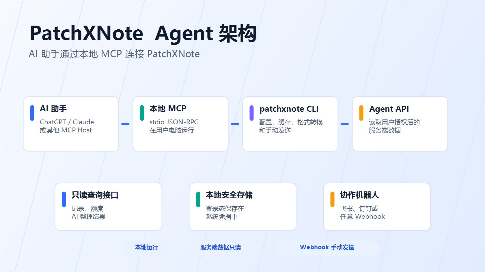

# PatchXNote Agent

[English](./README.md) | [简体中文](./README.zh-CN.md)

[](https://www.npmjs.com/package/patchxnote-agent)
[](https://github.com/ZsTs119/patchxnote-agent/releases)
[](./SECURITY.md)

Official documentation: [Public Chinese user guide on Feishu](https://patchx2025.feishu.cn/wiki/PnVRwYT7IirFPckairGcWPnHnCd)

Repository: [https://github.com/ZsTs119/patchxnote-agent](https://github.com/ZsTs119/patchxnote-agent)


PatchXNote Agent is the local AI assistant connector for PatchXNote. After installing it, you can let an AI assistant find PatchXNote records, inspect AI-generated results, create Markdown, and send user-approved messages to Feishu, DingTalk, or another webhook.

It helps your AI assistant search records synced from mobile or desktop, inspect the source text and AI output behind a processing run, save editable local drafts, and manually send the final text to a named webhook target.

PatchXNote server data access remains read-only. Agent does not operate hardware binding, read raw audio, handle payments, or expose Admin APIs. Webhook configuration and sending happen locally, and messages are sent only when you or your AI assistant explicitly call a send command.

Give this one-line prompt to a local-command-capable AI assistant:

```text
Install and connect PatchXNote Agent by following the public guide at https://patchx2025.feishu.cn/wiki/PnVRwYT7IirFPckairGcWPnHnCd: run npx -y patchxnote-agent install --print-config, guide me through patchxnote login, and add the printed MCP JSON config to this AI assistant. Do not ask me to paste OTP codes, access tokens, or refresh tokens into chat. GitHub repository: https://github.com/ZsTs119/patchxnote-agent
```

Or run the install command manually:

```sh
npx -y patchxnote-agent install --print-config
```

## At A Glance

| Area | Agent V1 behavior |
| --- | --- |
| Runtime | Installs a versioned native `patchxnote` binary through an npm wrapper. |
| AI connection | Runs a local stdio MCP server with `patchxnote mcp serve`. |
| Login | Phone OTP login creates an independent Agent session, not an App/PC installation. |
| Data access | Shows account, recorder cards, quota, records, and AI-generated results. |
| Webhook | Locally configures named targets and manually sends to Feishu, DingTalk, or another webhook. |
| Safety boundary | Server data is read-only; raw audio, hardware, payment, and Admin APIs are not exposed. |
| Package status | Public beta `0.2.4`, defaulting to the PatchXNote public beta API. |

## Features

| Capability | Available in `0.2.4` | Notes |
| --- | --- | --- |
| Phone OTP Agent login | Yes | Uses Agent-specific server auth, not App/PC mobile or desktop installation slots. |
| Agent session refresh | Yes | Automatically rotates Agent access and refresh tokens from the local keychain. |
| Local MCP server | Yes | Lets MCP-capable AI assistants call PatchXNote Agent. |
| Account, recorder cards, quota | Yes | Shows account status, recorder-card list, quota, and current-month model usage. |
| Record list and search | Yes | Lists records by `mobile` or `desktop`, and searches record basics cached in the current MCP session. |
| Single record details | Yes | Shows safe basic information for one record. |
| AI processing lookup | Yes | Finds an AI processing run and the follow-up `request_id`. |
| Source text and AI result export | Yes | Explicitly inspect or export source text, AI response, parsed result, and final result. |
| Multiple webhook aliases | Yes | Configure multiple Feishu, DingTalk, or generic webhooks with custom names, including Chinese names and spaces. |
| Markdown drafts | Yes | Render a record into a local Markdown draft so the user can edit before sending. |
| Manual webhook send | Yes | Sends only when the user or AI explicitly invokes a send command; no background push. |
| Raw audio/audio download | No | Agent does not read raw audio and does not provide audio downloads. |
| Hardware bind/release/recovery | No | Owned by App/PC and MR20 flows. |
| Model execution/replay | No | Agent does not trigger new model runs or replay model calls. |
| Payment/purchase/Admin APIs | No | Quota purchase, payments, and Admin APIs are out of scope. |

## Requirements

- Node.js `18` or newer for the npm installer wrapper.
- Windows, macOS, or Linux on `amd64` or `arm64`.
- A PatchXNote account that can receive the phone OTP login code.
- An MCP host that supports stdio MCP servers, such as Codex, Claude Desktop, Cursor, VS Code, or another compatible desktop agent.

> `0.2.4` is a public beta build. The default server is the PatchXNote public beta API. Credentials are stored in the OS-native keychain by default.

## Quickstart


Install the npm wrapper. It downloads the matching `patchxnote` binary from GitHub Releases, verifies `checksums.txt`, and installs it into a user-writable directory.

```sh
npx -y patchxnote-agent install --print-config
```

To pin the current public beta version for troubleshooting or rollback:

```sh
npx -y patchxnote-agent@0.2.4 install --print-config
```

The installer prints:

- the installed binary path
- a PATH hint if `patchxnote` is not already on your terminal PATH
- an MCP config snippet using the absolute binary path

The public beta build defaults to the PatchXNote public beta API:

```text
https://ws-lab.patch-x.cn/patchnote-test-api
```

Log in and check your session:

```sh
patchxnote login
patchxnote auth status
```

Start the MCP server:

```sh
patchxnote mcp serve
```

To target a different PatchXNote environment:

```sh
PATCHXNOTE_SERVER_BASE_URL=<PatchXNote API base URL> \
patchxnote login
```

## Common Workflows

Ask your AI assistant:

```text
Find today's mobile records.
Show the AI result behind this record.
Send this Markdown to my Product Feishu webhook.
Export the AI response to a local JSON file.
Create a Markdown draft from this record so I can edit it before sending.
```

## MCP Configuration



Use the `--print-config` output from the installer. A typical config looks like this:

```json
{
  "mcpServers": {
    "patchxnote": {
      "command": "/absolute/path/to/patchxnote",
      "args": ["mcp", "serve"]
    }
  }
}
```

MCP config never contains access tokens or refresh tokens. PatchXNote Agent stores credential material in macOS Keychain, Windows Credential Manager, or Linux Secret Service when available. The explicit `PATCHXNOTE_AUTH_INSECURE_FILE_KEYCHAIN=true` file store remains for local development and CI smoke only.

## MCP Tools


PatchXNote Agent `0.2.4` exposes **19 MCP tools**. End users can think of them as three groups; exact tool names are for MCP hosts and AI assistants.

### Account And Record Lookup

| Tool | Purpose |
| --- | --- |
| `patchxnote_get_current_user` | Show the current PatchXNote account status. |
| `patchxnote_list_recorder_cards` | List bound recorder cards with masked identifiers only. |
| `patchxnote_get_quota_summary` | Show current quota. |
| `patchxnote_get_model_usage_summary` | Show current-month AI usage and charged quota. |
| `patchxnote_list_memories` | List records for `mobile` or `desktop`. |
| `patchxnote_search_memories` | Search record basics cached in the current MCP session. |
| `patchxnote_get_memory` | Show safe basic information for one record. |

### Webhook Configuration And Sending

| Tool | Purpose |
| --- | --- |
| `patchxnote_list_webhook_targets` | List local webhook aliases and masked metadata. |
| `patchxnote_configure_webhook_target` | Create or update a webhook alias; URL and secret inputs are write-only. |
| `patchxnote_remove_webhook_target` | Remove a webhook alias and best-effort clean up stored secrets. |
| `patchxnote_list_webhook_templates` | List built-in Markdown templates. |
| `patchxnote_render_webhook_message` | Render a record into Markdown and optionally save a local draft. |
| `patchxnote_export_model_io` | Export a complete AI processing record to a user-chosen local file. |
| `patchxnote_send_webhook` | Manually send Markdown, a draft, a rendered record, or a test message to target aliases. |

### AI Result Inspection

| Tool | Purpose |
| --- | --- |
| `patchxnote_list_model_io_traces` | Find AI processing runs and the follow-up `request_id`. |
| `patchxnote_get_model_io_source_text` | Inspect or export the source text used for that run. |
| `patchxnote_get_model_io_provider_response` | Inspect or export the AI response. |
| `patchxnote_get_model_io_parsed_result` | Inspect or export the parsed AI result. |
| `patchxnote_get_model_io_packaged_result` | Inspect or export the final result. |

Record tools require an explicit `platform` argument: `mobile` or `desktop`. The normal record list and the AI processing list are not the same data source; some accounts may have AI processing runs even when the normal record list is empty.

Webhook MCP tools share the same local config, keychain, templates, and sender modules as the CLI. They do not return full webhook URLs or signing secrets, and send calls perform external network requests only when the MCP client explicitly invokes the send tool.

AI result tools are explicit inspection tools. They may expose source text or AI payloads for the logged-in user, so use them only from trusted local MCP hosts. Large fields should be written to an explicit local `out` file.

## CLI Commands

Install and login:

```sh
patchxnote version
patchxnote login
patchxnote auth status
patchxnote logout
patchxnote mcp serve
```

List AI processing runs and export results:

```sh
patchxnote model-io list --platform mobile
patchxnote model-io source-text --request-id <request_id> --platform mobile --out ./source.txt
patchxnote model-io provider-response --request-id <request_id> --platform mobile --out ./provider-response.json
patchxnote model-io parsed-result --request-id <request_id> --platform mobile --out ./parsed-result.json
patchxnote model-io packaged-result --request-id <request_id> --platform mobile --out ./packaged-result.json
patchxnote model-io export --request-id <request_id> --platform mobile --out ./model-io.json
```

Get `request_id` from `patchxnote model-io list --platform mobile|desktop`. Use `memory_id` for record rendering and draft workflows; use `request_id` when inspecting the content behind an AI processing run.

Configure and send webhooks:

```sh
patchxnote webhook set "Product Feishu" --type feishu --url-stdin
patchxnote webhook list
patchxnote webhook test "Product Feishu"
patchxnote webhook draft --memory-id <memory_id> --platform mobile --out ./patchxnote-drafts/example
patchxnote webhook send --target "Product Feishu" --file ./message.md
patchxnote webhook send --target "Product Feishu" --draft ./patchxnote-drafts/example
patchxnote webhook remove "Product Feishu"
```

Useful global flags:

```sh
--server-base-url <url>   PatchXNote API base URL
--profile <name>          local profile name
--output json             machine-readable output where supported
--config <path>           non-secret config file path
```

The npm package itself is only an installer/update wrapper:

```sh
npx -y patchxnote-agent@0.2.4 install
npx -y patchxnote-agent@0.2.4 update
npx -y patchxnote-agent@0.2.4 uninstall
```

Webhook URLs and optional Feishu/DingTalk signing secrets are stored in the local secure credential store, not in the non-secret config file. `--url-stdin` and `--secret-stdin` avoid shell history. CLI and MCP webhook sending is manual only, does not follow redirects, and surfaces provider errors directly.

`patchxnote model-io export` is the preferred complete AI processing export command. `patchxnote webhook export-model-io` remains available for compatibility.

## Security And Risk Notice


PatchXNote Agent gives an AI assistant access to account and record information for the logged-in PatchXNote user. Treat the MCP host as trusted software and review prompts, tool calls, local files, and logs that may contain account context, source text, or AI results.

Default safety boundaries:

- Agent auth is separate from App/PC `mobile` and `desktop` installations.
- Agent calls only dedicated read-only `/v1/agent/**` server routes for PatchXNote server data.
- MCP webhook tools can write local non-secret target metadata, write URL/secret material to local secure storage, and manually send external webhook HTTP requests.
- Webhook sending never happens in the background and is not scheduled automatically.
- MCP runs locally over stdio; stdout is reserved for JSON-RPC.
- MCP config does not store bearer tokens, refresh tokens, OTPs, SK, or full MAC values.
- Recorder-card identifiers are masked; live BLE state, battery, storage, and recording status are not exposed.
- Content is platform-scoped. The Agent does not merge mobile and desktop content.
- Tool outputs are bounded and validated before being returned to the MCP client.
- Webhook target URLs and signing secrets stay in local secure storage; normal webhook payloads never include access tokens, refresh tokens, or exported AI processing JSON.
- AI result tools return only the requested field. They do not replay model calls and do not include unrelated fields in single-field responses.
- Agent does not read raw audio and does not provide audio downloads. Source text and AI results are available only through explicit tool calls, and large/sensitive content should be exported to local files.

Do not paste access tokens, refresh tokens, OTP codes, raw phone numbers, full MAC values, SK values, raw audio, source text, prompts, or provider payloads into public issues. Use the private process in [SECURITY.md](./SECURITY.md) for vulnerability reports.

## Current Limitations

`0.2.4` is a beta release.

- The default server points to the PatchXNote public beta API and does not imply a production SLA.
- Linux headless environments may not have Secret Service available; use the explicit development file-store fallback only for local smoke.
- Public beta users should expect iterative improvements to setup guidance, MCP client examples, and webhook formatting.
- `patchxnote_search_memories` searches only record basics cached during the current MCP session.
- If the normal record list is empty, first check whether you selected `mobile` or `desktop`. AI processing runs can also be listed separately with `patchxnote model-io list`.
- Raw audio, audio downloads, hardware write actions, model execution/replay, automatic webhook pushes, quota purchase/reward actions, payment, and Admin APIs are out of scope.

## Troubleshooting

| Problem | What to check |
| --- | --- |
| `patchxnote` is not found after install | Add the printed install directory to PATH, then open a new terminal. |
| Login says credential storage is unavailable | Check that macOS Keychain, Windows Credential Manager, or Linux Secret Service is available and unlocked. For local development only, set `PATCHXNOTE_AUTH_INSECURE_FILE_KEYCHAIN=true`. |
| MCP host cannot start the server | Use the absolute `command` path printed by `--print-config`. |
| Record list is empty | Check that you selected the correct `platform`: `mobile` or `desktop`; use `model-io list` for AI processing runs. |
| Webhook did not send | Confirm the alias exists, the target is enabled, and check the provider error returned by the command. |
| Checksum verification fails | Retry later or pin a known version; the installer refuses unchecked binaries. |
| Wrong server environment | Set `PATCHXNOTE_SERVER_BASE_URL=<PatchXNote API base URL>`. |

## Verify The Install

```sh
npm view patchxnote-agent@0.2.4 version --registry https://registry.npmjs.org
npx -y --registry https://registry.npmjs.org patchxnote-agent@0.2.4 install --dry-run --print-config
patchxnote version
```

The release binary should report version `0.2.4` and the commit attached to the `v0.2.4` GitHub Release.

## 0.2.4 Highlights

- MCP expands to 19 tools across account/record lookup, webhook delivery, and AI result inspection.
- Webhook workflows are available to MCP: configure named aliases and manually send to Feishu, DingTalk, or generic webhooks.
- AI processing runs can be listed first, then inspected by `request_id` for source text, AI response, parsed result, and final result.
- README, npm README, and public visual assets have been refreshed for the new user-facing positioning.

## Development

Local checks:

```sh
go test ./...
scripts/e2e/mvp-smoke.sh
node packages/npm/test/install.test.js
```

The MVP smoke builds the CLI, runs installer dry-run, logs in against an in-process Agent V1 test server, checks `auth status`, starts `patchxnote mcp serve`, calls all 19 V1 MCP tools, exercises AI processing discovery, field export, and local webhook delivery, logs out, and scans evidence for secret-like values.

Before changing CLI behavior, installer logic, MCP tools, authentication, local cache, or release configuration, read:

- [AGENTS.md](./AGENTS.md)
- [docs/engineering-rules.md](./docs/engineering-rules.md)
- [docs/release-and-maintenance-runbook.zh-CN.md](./docs/release-and-maintenance-runbook.zh-CN.md)
- [docs/plans/2026-08-06-agent-v1-mvp.md](./docs/plans/2026-08-06-agent-v1-mvp.md)

## Release Notes For Operators

The detailed release and documentation maintenance checklist lives in [docs/release-and-maintenance-runbook.zh-CN.md](./docs/release-and-maintenance-runbook.zh-CN.md).

1. Confirm the target PatchXNote GoServer exposes the required `/v1/agent/**` routes.
2. Confirm `packages/npm/package.json` version matches the release tag without the leading `v`.
3. Push a clean tag, for example `v0.2.4`.
4. Wait for GitHub Release assets: `checksums.txt` plus Linux/macOS/Windows amd64 and arm64 binaries.
5. Configure npm Trusted Publishing for this GitHub Actions workflow before npm publish:
   - owner/user: `ZsTs119`
   - repository: `patchxnote-agent`
   - workflow filename: `publish-npm.yml`
   - allowed action: `npm publish`
6. Publish npm only after release assets exist and the trusted publisher is configured.
7. After a successful trusted publish, revoke the old npm automation token and disallow token-based publishing for this package.

## License

This repository is currently published without an open-source license. Contact PatchXNote before redistributing or embedding it in another product.
