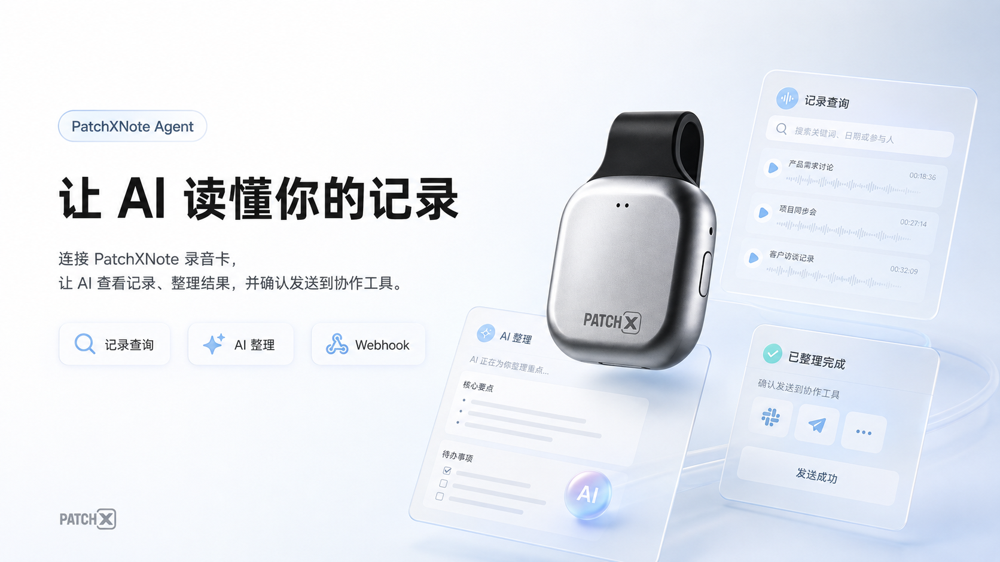
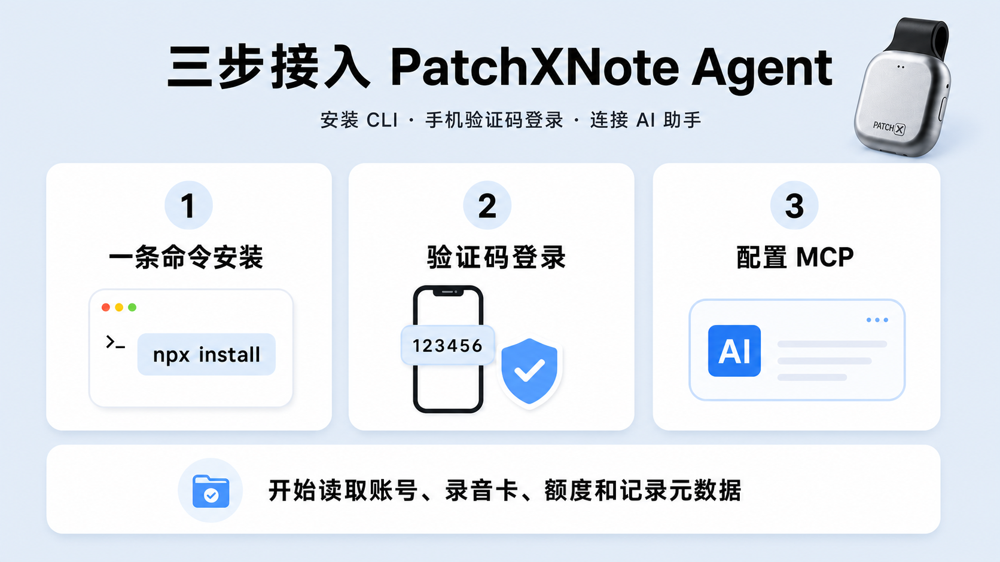
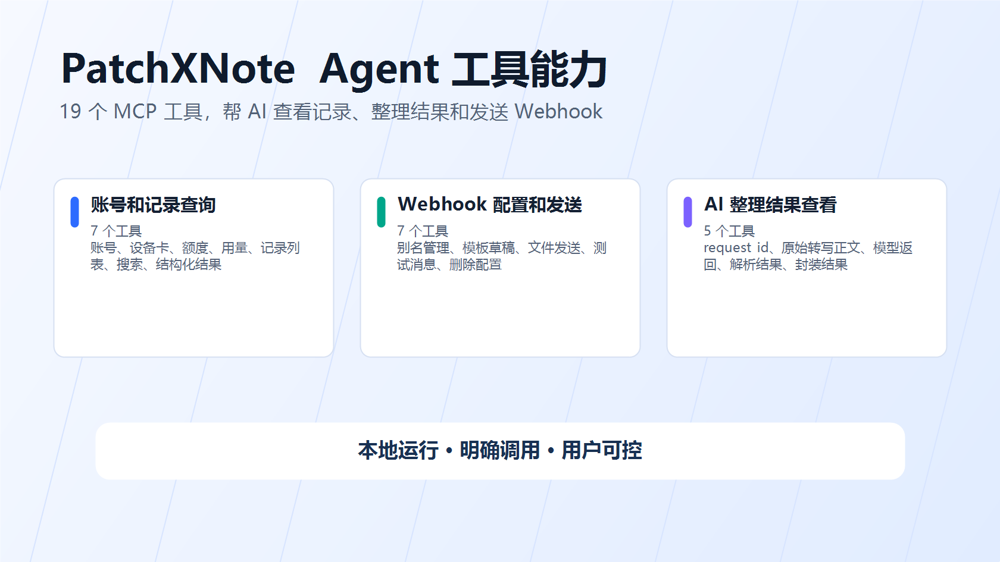
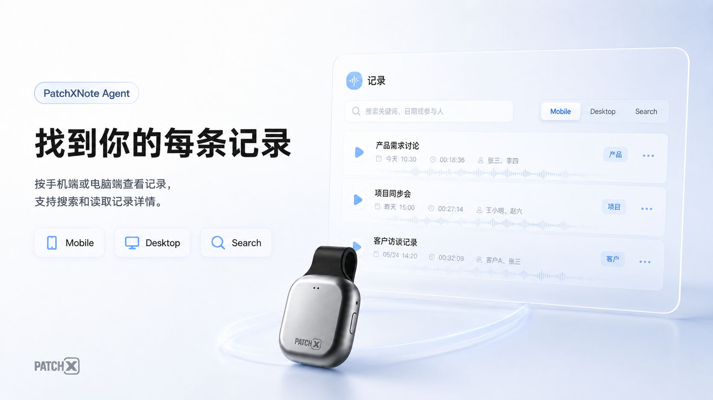
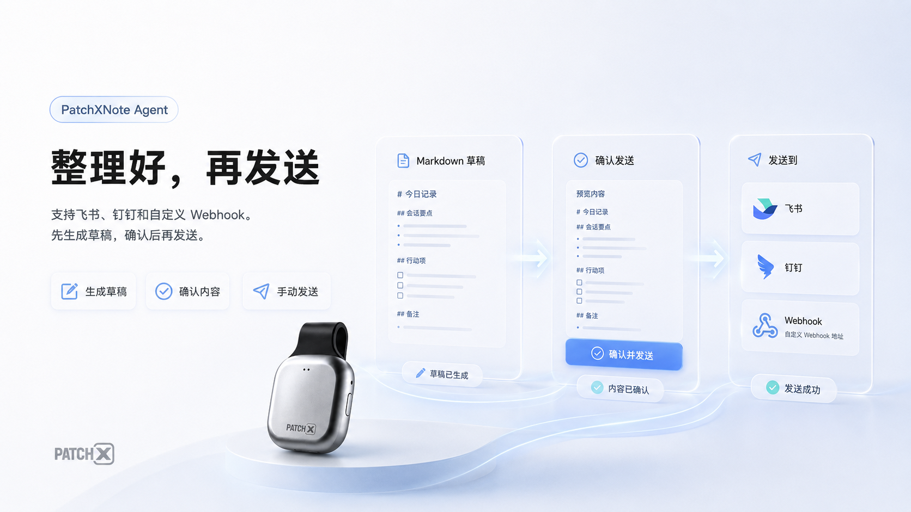
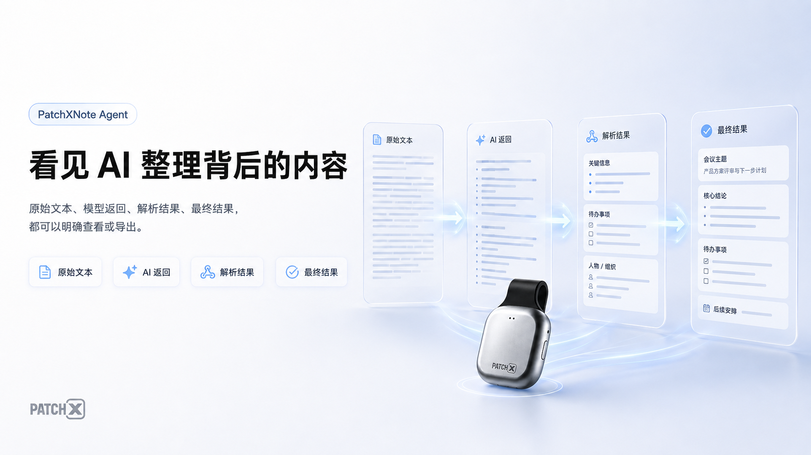
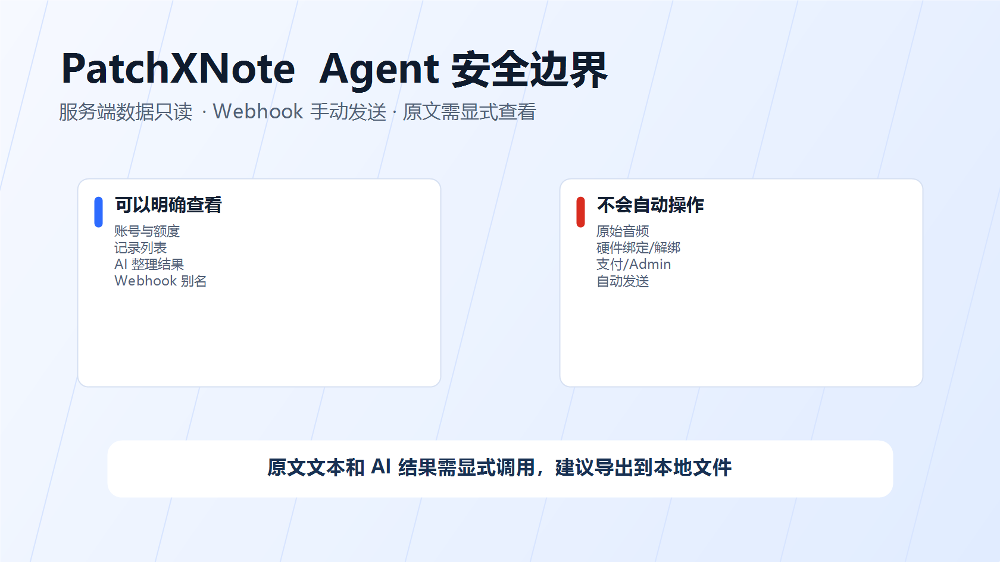

# PatchXNote Agent

[English](./README.md) | [简体中文](./README.zh-CN.md)

[](https://www.npmjs.com/package/patchxnote-agent)
[](https://github.com/ZsTs119/patchxnote-agent/releases)
[](./SECURITY.md)

官方文档：[PatchXNote Agent 公测使用指南（飞书公开版）](https://patchx2025.feishu.cn/wiki/PnVRwYT7IirFPckairGcWPnHnCd)

GitHub 仓库：[https://github.com/ZsTs119/patchxnote-agent](https://github.com/ZsTs119/patchxnote-agent)



PatchXNote Agent 是 PatchXNote 的本地 AI 助手连接器。安装后，你可以让 AI 帮你查看 PatchXNote 记录、读取 AI 整理结果、生成 Markdown，并在你确认后发送到飞书、钉钉或其他 webhook。

你可以让 AI 查找手机端或电脑端同步过来的记录，查看某次 AI 整理背后的原文文本、AI 返回内容和最终整理结果，也可以把整理好的内容保存成本地草稿，再手动发送到指定机器人。

PatchXNote 服务端数据访问仍是只读的。Agent 不操作硬件绑定、不读取原始音频、不处理支付或 Admin API。webhook 配置和发送只发生在你的本机，并且只有你或 AI 明确调用发送命令时才会发出去。

将以下一句话发送给支持本地命令执行的 AI 助手即可：

```text
请按照 PatchXNote Agent 使用指南（https://patchx2025.feishu.cn/wiki/PnVRwYT7IirFPckairGcWPnHnCd）帮我接入 MCP：先执行 npx -y patchxnote-agent@latest setup --client <我的客户端>，保持 MCP 配置里不放任何密钥，并引导我在真正启动 MCP 的同一个运行时完成登录；过程中不要让我把验证码、access token 或 refresh token 粘贴到对话里；GitHub 仓库是 https://github.com/ZsTs119/patchxnote-agent。
```

支持的客户端可以直接运行 setup：

```sh
npx -y patchxnote-agent@latest setup --client cursor
```

也可以手动打印通用 MCP 配置：

```sh
npx -y patchxnote-agent@latest mcp config
```

## 快速了解

| 维度 | Agent V1 行为 |
| --- | --- |
| 运行方式 | 通过 npm 安装壳下载、安装或校验版本化的原生 `patchxnote` 二进制。 |
| 连接 AI | 通过 `npx -y patchxnote-agent@latest mcp serve` 或绝对路径 fallback 启动本地 stdio MCP server。 |
| 登录 | MCP 浏览器 OAuth 通过 `patchxnote mcp login` 完成；终端 `patchxnote login` 只保留给旧的本地 Agent 路径。 |
| 数据访问 | 查看账号、录音卡、额度、记录列表、AI 整理结果。 |
| Webhook | 本地配置别名，手动发送到飞书、钉钉或其他 webhook。 |
| 安全边界 | 服务端数据只读；原始音频、硬件、支付和 Admin API 不开放。 |
| 包状态 | 当前公测版本 `0.2.8`，默认连接 PatchXNote 公测 API。 |

## 功能

| 能力 | `0.2.8` 是否支持 | 说明 |
| --- | --- | --- |
| 手机验证码 Agent 登录 | 支持 | 使用 Agent 专用登录态，不影响 App/PC 的 mobile/desktop 安装位。 |
| Agent 会话自动刷新 | 支持 | 从本机安全钥匙串自动轮换 Agent access token 和 refresh token。 |
| 本地 MCP server | 支持 | 让支持 MCP 的 AI 助手调用 PatchXNote Agent。 |
| 本地客户端 setup 向导 | 支持 | `patchxnote setup --client <id>` 会规划、确认、备份并写入已支持客户端配置；不安全或未验收的客户端返回手动说明。 |
| 账号、录音卡、额度 | 支持 | 查看当前账号状态、录音卡列表、额度和当月模型用量。 |
| 记录列表和搜索 | 支持 | 按 `mobile` 或 `desktop` 查看可读记录入口，包括已保存结果和模型整理输出，也可以搜索当前会话已缓存的记录基础信息。 |
| 单条记录详情 | 支持 | 查看一条记录的安全基础信息。 |
| AI 整理记录查看 | 支持 | 找到某次 AI 整理的处理编号，也就是命令里的 `request_id`。 |
| 原文文本和 AI 结果导出 | 支持 | 显式查看或导出原文文本、AI 返回内容、AI 解析后的结果、最终整理结果。 |
| 多 webhook 别名配置 | 支持 | 一个用户可以配置多个飞书、钉钉或其他 webhook，并给每个地址起中文名称。 |
| Markdown 草稿 | 支持 | 把记录渲染成本地 Markdown 草稿，用户可以先改再发。 |
| 手动 webhook 发送 | 支持 | 只有用户或 AI 明确调用发送命令时才会发送，不会后台自动推送。 |
| 原始音频/音频下载 | 不支持 | Agent 不读取原始音频，也不提供音频下载。 |
| 硬件绑定/解绑/恢复 | 不支持 | 仍由 App/PC 和 MR20 流程负责。 |
| 模型执行/重放 | 不支持 | Agent 不触发新的模型整理，也不重放模型调用。 |
| 支付/购买/Admin API | 不支持 | 不处理额度购买、支付或 Admin API。 |

## 环境要求

- Node.js `18` 或更高版本，用于 npm 安装/启动壳。
- Windows、macOS 或 Linux，支持 `amd64` 和 `arm64`。
- 可以接收手机验证码的 PatchXNote 账号。
- 支持 stdio MCP server 的 MCP Host，例如 Codex、Claude Desktop、Cursor、VS Code 或其他兼容桌面 Agent。

> `0.2.8` 是当前公测版本。默认服务端是 PatchXNote 公测 API，凭据默认写入系统原生安全钥匙串。

## 快速开始



先按你使用的客户端运行 setup：

```sh
npx -y patchxnote-agent@latest setup --client vscode
npx -y patchxnote-agent@latest setup --client cursor
npx -y patchxnote-agent@latest setup --client codex
npx -y patchxnote-agent@latest setup --client workbuddy
```

setup 会检查 MCP 浏览器 OAuth 登录、把凭据保存在 OS 安全存储里、写入或打印客户端 MCP 配置，并且在修改已支持配置文件前创建备份。

你也可以先显式登录再添加客户端：

```sh
npx -y patchxnote-agent@latest mcp login
npx -y patchxnote-agent@latest mcp status
```

也可以继续打印通用 MCP 配置，把输出粘贴到支持本地 stdio MCP 的 AI 助手或编辑器里：

```sh
npx -y patchxnote-agent@latest mcp config
```

生成的配置会通过下面的命令启动 PatchXNote Agent：

```sh
npx -y patchxnote-agent@latest mcp serve
```

第一次启动时，npm wrapper 会从 GitHub Releases 下载匹配平台的 `patchxnote` 二进制，校验 `checksums.txt`，安装到用户可写目录，然后委托给 `patchxnote mcp serve`。MCP 的 stdout 仍然只保留给 JSON-RPC。

旧的终端 Agent 登录仍可用于 legacy 本地 CLI/MCP fallback：

```sh
npx -y patchxnote-agent@latest login
```

如果某个 MCP Host 在首次下载二进制时超时，可以先运行一次稳定 fallback，并复制它打印的绝对路径配置：

```sh
npx -y patchxnote-agent@latest install --print-config
```

如果需要固定当前已发布公测版本用于排障或回滚：

```sh
npx -y patchxnote-agent@0.2.8 install --print-config
```

公测版本默认连接 PatchXNote 公测 API：

```text
https://ws-lab.patch-x.cn/patchnote-test-api
```

如果要切换到其他 PatchXNote 环境：

```sh
PATCHXNOTE_SERVER_BASE_URL=<PatchXNote API base URL> \
patchxnote mcp login
```

## 常用场景

可以直接让 AI 这样做：

```text
帮我找今天手机端的记录。
查看这条记录的 AI 整理结果。
把这段 Markdown 发到“产品群 飞书”。
把 AI 返回内容导出到本地 JSON 文件。
把这条记录生成 Markdown 草稿，我改完再发送。
```

## 客户端 setup

本地 setup 第一版支持这些 P0 客户端 ID：

```text
vscode, cursor, codex, claude-code, claude-desktop, windsurf, trae, qoder, workbuddy
```

`vscode`、`cursor`、`codex`、`claude-desktop`、`windsurf` 会在确认后写入本地配置文件。`claude-code`、`trae`、`qoder`、`workbuddy` 在 V1 返回手动命令或可复制配置。飞书 Aily、豆包工作伙伴、腾讯 Agent 平台、企业版 WorkBuddy 这类平台客户端需要走服务端远程 MCP 网关，并在平台控制台完成真实验收，不能只靠本机 `npx`。

常用 setup 参数：

```sh
patchxnote setup --client cursor --dry-run --print-config
patchxnote setup --client cursor --yes
patchxnote setup --client cursor --no-browser
patchxnote setup --all-local-supported --dry-run
patchxnote setup --client cursor --output json
```

请在未来真正启动 MCP 的同一个 OS/运行时执行 setup。比如 Windows 桌面编辑器使用 Windows Credential Manager，WSL 或 VS Code Remote 则需要在对应 Linux 运行时登录。

## MCP 配置

通用本地 stdio MCP Host 可以直接使用下面命令打印的纯 JSON：

```sh
npx -y patchxnote-agent@latest mcp config
```

默认配置如下：

```json
{
  "mcpServers": {
    "patchxnote": {
      "command": "npx",
      "args": ["-y", "patchxnote-agent@latest", "mcp", "serve"]
    }
  }
}
```

有些客户端可能要求额外写 `type: "stdio"`，或者使用不同的顶层字段名，但 `command` 和 `args` 不变。如果客户端拒绝 `npx`、首次冷启动太慢或只允许白名单绝对路径，可以改用下面命令打印的 fallback：

```sh
npx -y patchxnote-agent@latest install --print-config
```

fallback 配置会使用已安装二进制的绝对路径：

```json
{
  "mcpServers": {
    "patchxnote": {
      "command": "/absolute/path/to/patchxnote",
      "args": ["mcp", "serve"]
    }
  }
}
```

MCP 配置中不会保存 access token、refresh token、验证码、手机号、webhook 密钥，默认也不包含 base URL。PatchXNote Agent 默认把凭据写入 macOS Keychain、Windows Credential Manager 或 Linux Secret Service。显式的 `PATCHXNOTE_AUTH_INSECURE_FILE_KEYCHAIN=true` 文件存储仅保留给本地开发和 CI 冒烟。

## MCP 工具



PatchXNote Agent `0.2.8` 暴露和当前本地服务一致的 **19 个本地 MCP 工具**。普通用户可以先理解成三类能力，下面的英文工具名是给 MCP Host 和 AI 助手调用用的。

### 账号和记录查询



| 工具 | 用途 |
| --- | --- |
| `patchxnote_get_current_user` | 查看当前 PatchXNote 账号状态。 |
| `patchxnote_list_recorder_cards` | 查看已绑定录音卡，只返回脱敏标识。 |
| `patchxnote_get_quota_summary` | 查看当前账号额度。 |
| `patchxnote_get_model_usage_summary` | 查看当月 AI 使用情况和扣费额度。 |
| `patchxnote_list_memories` | 按 `mobile` 或 `desktop` 查看可读记录入口。 |
| `patchxnote_search_memories` | 搜索当前会话已缓存的记录基础信息。 |
| `patchxnote_get_memory` | 查看单条记录的安全基础信息。 |

### Webhook 配置和发送



| 工具 | 用途 |
| --- | --- |
| `patchxnote_list_webhook_targets` | 查看本机配置过的 webhook 别名和脱敏信息。 |
| `patchxnote_configure_webhook_target` | 新增或更新 webhook 别名；URL 和密钥是只写输入。 |
| `patchxnote_remove_webhook_target` | 删除 webhook 别名并尽力清理本机密钥。 |
| `patchxnote_list_webhook_templates` | 查看内置 Markdown 模板。 |
| `patchxnote_render_webhook_message` | 把记录渲染成 Markdown，可选保存成本地草稿。 |
| `patchxnote_export_model_io` | 把完整 AI 整理记录导出到用户指定的本地文件。 |
| `patchxnote_send_webhook` | 手动发送 Markdown、草稿、记录渲染结果或测试消息到指定别名。 |

### AI 整理结果查看



| 工具 | 用途 |
| --- | --- |
| `patchxnote_list_model_io_traces` | 查找 AI 整理记录，拿到后续查看用的处理编号 `request_id`。 |
| `patchxnote_get_model_io_source_text` | 查看或导出当时使用的原文文本。 |
| `patchxnote_get_model_io_provider_response` | 查看或导出 AI 返回内容。 |
| `patchxnote_get_model_io_parsed_result` | 查看或导出 AI 解析后的结果。 |
| `patchxnote_get_model_io_packaged_result` | 查看或导出最终整理结果。 |

记录类工具必须显式传入 `platform`：`mobile` 或 `desktop`。记录列表现在会包含正式保存结果，也会包含服务端已有 model IO 的模型整理输出。`patchxnote model-io list` 仍然是更底层的 AI 调用列表，适合按任务类型、状态或 request_id 排查。

webhook MCP 工具复用 CLI 的本地配置、钥匙串、模板和发送模块。工具不会返回完整 webhook URL 或签名密钥；只有 MCP client 明确调用发送工具时才会发起外部网络请求。

AI 整理结果工具是显式查看能力。它可能返回当前登录用户的原文文本或 AI 结果，因此只建议在可信本地 MCP Host 中使用。大字段建议写入显式 `out` 本地文件。

## CLI 命令

安装和登录：

```sh
patchxnote version
patchxnote login
patchxnote auth status
patchxnote setup --client cursor
patchxnote logout
patchxnote mcp serve
```

查看 AI 整理记录和导出结果：

```sh
patchxnote model-io list --platform mobile
patchxnote model-io source-text --request-id <request_id> --platform mobile --out ./source.txt
patchxnote model-io provider-response --request-id <request_id> --platform mobile --out ./provider-response.json
patchxnote model-io parsed-result --request-id <request_id> --platform mobile --out ./parsed-result.json
patchxnote model-io packaged-result --request-id <request_id> --platform mobile --out ./packaged-result.json
patchxnote model-io export --request-id <request_id> --platform mobile --out ./model-io.json
```

需要底层 AI 调用记录时，`request_id` 来自 `patchxnote model-io list --platform mobile|desktop`。MCP `patchxnote_list_memories` 会返回 `id` 和 `platform`，可用于记录渲染、草稿、webhook 和 model IO 字段工具；如果这条入口来自模型整理输出，这个 `id` 也可以就是 `request_id`。

配置和发送 webhook：

```sh
patchxnote webhook set "产品群 飞书" --type feishu --url-stdin
patchxnote webhook list
patchxnote webhook test "产品群 飞书"
patchxnote webhook draft --memory-id <memory_id> --platform mobile --out ./patchxnote-drafts/example
patchxnote webhook send --target "产品群 飞书" --file ./message.md
patchxnote webhook send --target "产品群 飞书" --draft ./patchxnote-drafts/example
patchxnote webhook remove "产品群 飞书"
```

常用全局参数：

```sh
--server-base-url <url>   PatchXNote API base URL
--profile <name>          本地 profile 名称
--output json             支持时输出机器可读 JSON
--config <path>           非 secret 配置文件路径
```

npm 包本身是轻量安装/启动壳：

```sh
npx -y patchxnote-agent@latest mcp config
npx -y patchxnote-agent@latest mcp serve
npx -y patchxnote-agent@latest login
npx -y patchxnote-agent@latest setup --client cursor
npx -y patchxnote-agent@latest install
npx -y patchxnote-agent@latest update
npx -y patchxnote-agent@latest uninstall
```

webhook URL 和飞书/钉钉可选签名密钥只写入本机安全钥匙串，不写普通配置文件。建议用 `--url-stdin` 和 `--secret-stdin` 避免 shell history。CLI 和 MCP 的 webhook 发送都只支持用户手动执行，不跟随重定向，下游平台错误会直接透传给用户。

`patchxnote model-io export` 是完整 AI 整理记录导出的推荐命令。`patchxnote webhook export-model-io` 会继续兼容保留。

## 安全与风险提示



PatchXNote Agent 会让 AI Agent 访问当前登录 PatchXNote 用户的账号和记录信息。请把 MCP Host 视为受信软件，并注意 prompt、工具调用、本地文件和日志中可能出现的账号上下文、原文文本或 AI 结果。

默认安全边界：

- Agent 登录态独立于 App/PC 的 `mobile` 和 `desktop` 安装位。
- Agent 读取 PatchXNote 服务端数据时只调用专用只读 `/v1/agent/**` 服务端路由。
- MCP webhook 工具可以写入本地非 secret 目标元数据，把 URL/密钥写入本机安全存储，并手动发送外部 webhook HTTP 请求。
- webhook 发送不会后台自动发生，也不会自动定时推送。
- MCP 在本地通过 stdio 运行；stdout 只用于 JSON-RPC。
- MCP 配置不保存 bearer token、refresh token、验证码、SK 或完整 MAC。
- 录音卡标识会被脱敏；不暴露实时 BLE 状态、电量、存储和录音状态。
- 内容按平台隔离。Agent 不会合并 mobile 和 desktop 内容。
- 工具输出在返回给 MCP client 前会做边界控制和校验。
- webhook URL 和签名密钥只保存在本机安全存储；普通 webhook payload 不包含 access token、refresh token 或导出的 AI 整理记录 JSON。
- AI 整理结果工具只返回用户请求的字段，不重放模型调用，也不会在单字段响应里夹带无关字段。
- Agent 不读取原始音频，也不提供音频下载。可查看的原文文本和 AI 结果必须由用户或 AI 明确调用工具后读取，且建议导出到本地文件。

不要把 access token、refresh token、验证码、原始手机号、完整 MAC、SK、原始音频、原文文本、prompt 或供应商 payload 发到公开 Issue。安全问题请使用 [SECURITY.md](./SECURITY.md) 中的私密流程。

## 当前限制

`0.2.8` 是当前公测版本。

- 默认服务端指向 PatchXNote 公测 API，不代表生产 SLA。
- `mcp serve` 在编辑器启动时不会自动弹浏览器。请先运行 `mcp login`，或让 `setup --client <id>` 复用同一套 OAuth 流程。
- GoServer 官网和授权页负责手机验证码输入；本地 Agent 负责 loopback callback、token 交换、安全存储和 stdio 桥接。
- 飞书 Aily、豆包工作伙伴、腾讯 Agent 平台、企业版 WorkBuddy 的平台 MCP 需要完成平台控制台里的远程 MCP 验收；本地 `npx` setup 只闭环桌面/终端客户端。
- Linux 无桌面/headless 环境可能没有 Secret Service；此时仅本地冒烟可显式开启开发文件存储 fallback。
- 公测期间会持续优化安装流程、MCP 客户端示例和 webhook 格式效果。
- `patchxnote_search_memories` 只搜索当前 MCP 会话中已缓存的记录基础信息。
- 记录列表为空时，先确认选择的是 `mobile` 还是 `desktop`。底层 AI 调用记录可通过 `patchxnote model-io list` 单独查看。
- 原始音频、音频下载、硬件写操作、模型执行/重放、自动 webhook 推送、额度购买/领取、支付和 Admin API 都不在 V1 范围内。

## 常见问题排查

| 问题 | 检查项 |
| --- | --- |
| 安装后找不到 `patchxnote` | 把安装器打印的目录加入 PATH，然后打开新终端。 |
| 登录提示凭据存储不可用 | 检查 macOS Keychain、Windows Credential Manager 或 Linux Secret Service 是否可用且已解锁。本地开发才使用 `PATCHXNOTE_AUTH_INSECURE_FILE_KEYCHAIN=true`。 |
| MCP 登录过期或连到了错误服务端 | 先运行 `npx -y patchxnote-agent@latest mcp logout --local-only`，再在同一个运行时执行 `npx -y patchxnote-agent@latest mcp login`。 |
| MCP Host 启动失败 | 如果首次启动较慢或客户端拒绝 `npx`，先运行 `npx -y patchxnote-agent@latest install --print-config`，再使用它打印出的绝对 `command` 路径。 |
| setup 把登录态写到了错误环境 | 在真正启动 MCP server 的同一个 OS/运行时执行 setup。Windows 桌面应用、WSL 终端、VS Code Remote 默认不共享钥匙串。 |
| 需要撤销 setup 修改 | 恢复 setup 打印的时间戳 `.bak-YYYYMMDDTHHMMSSZ` 备份文件，或只删除客户端配置里的 `patchxnote` MCP server 项。 |
| 记录列表为空 | 检查是否选择了正确的 `platform`：`mobile` 或 `desktop`；底层 AI 调用记录请用 `model-io list`。 |
| webhook 没发出去 | 确认别名存在、目标启用，并检查下游平台返回的错误信息。 |
| checksum 校验失败 | 稍后重试或固定已知版本；安装器会拒绝未校验二进制。 |
| 连到了错误服务端 | 设置 `PATCHXNOTE_SERVER_BASE_URL=<PatchXNote API base URL>`。 |

## 验证安装

```sh
npm view patchxnote-agent@latest version --registry https://registry.npmjs.org
npx -y --registry https://registry.npmjs.org patchxnote-agent@latest mcp config
npx -y --registry https://registry.npmjs.org patchxnote-agent@latest mcp status --output json
npx -y --registry https://registry.npmjs.org patchxnote-agent@latest mcp logout --local-only --output json
npx -y --registry https://registry.npmjs.org patchxnote-agent@latest setup --client cursor --dry-run --print-config
npx -y --registry https://registry.npmjs.org patchxnote-agent@latest install --dry-run --print-config
patchxnote version
```

发布二进制应报告 npm 包版本，commit 应为对应 GitHub Release tag 的提交。

## 0.2.8 更新重点

- 新增 `patchxnote setup --client <id>` 和 npm wrapper 转发，支持 dry-run、JSON 输出、确认写入、配置打印、force 修复和本地 MCP 冒烟钩子。
- 新增客户端 registry，覆盖 VS Code、Cursor、Codex、Claude Code、Claude Desktop、Windsurf、Trae、Qoder、WorkBuddy、飞书/豆包、腾讯平台和 P1 后续客户端。
- 新增 JSON/TOML 配置合并适配器，带备份、冲突检测、回滚和 JSONC 手动模式。
- 新增 `patchxnote mcp login/status/logout`、带 PKCE 的浏览器 OAuth、MCP OAuth 安全存储，以及远程 `/mcp` stdio 代理模式和本地 fallback。
- 新增官网页面规格、客户端详情页文案和远程平台 MCP 网关设计。

## 0.2.6 更新重点

- MCP 工具扩展到 19 个，覆盖账号和记录查询、webhook 配置发送、AI 整理结果查看。
- webhook 支持 MCP 调用：可以配置中文别名，手动发送到飞书、钉钉或其他 webhook。
- 新增 AI 整理记录列表，AI 可以先找到 `request_id`，再查看原文文本、AI 返回内容、解析结果和最终整理结果。
- 记录列表现在可以包含服务端返回的模型整理输出，用户可以先找到记录入口，再查看原文文本、AI 返回内容、解析结果或最终整理结果。
- webhook 别名里包含点号、中文和空格时，现在可以正确保存并重新读取。
- README、npm README 和公开图片素材已按新能力更新。

## 开发

本地检查：

```sh
go test ./...
scripts/e2e/mvp-smoke.sh
node packages/npm/test/install.test.js
node docs/mcp-clients/validate-clients.mjs
```

MVP smoke 会构建 CLI，执行安装器 dry-run，检查 npm 通用 MCP 启动入口和 `mcp login/status/logout` 非交互路径，登录进程内 Agent V1 测试服务，检查 `auth status`，启动 `patchxnote mcp serve`，调用全部 19 个 V1 MCP 工具，覆盖 AI 整理记录发现、字段导出和本地 webhook 发送，登出，并扫描 evidence 中是否出现 secret-like 内容。

修改 CLI 行为、安装器逻辑、MCP 工具、认证、本地缓存或发布配置前，请先阅读：

- [AGENTS.md](./AGENTS.md)
- [docs/engineering-rules.md](./docs/engineering-rules.md)
- [docs/release-and-maintenance-runbook.zh-CN.md](./docs/release-and-maintenance-runbook.zh-CN.md)
- [docs/plans/2026-08-06-agent-v1-mvp.md](./docs/plans/2026-08-06-agent-v1-mvp.md)

## 发布维护说明

详细发包和文档同步 checklist 见 [docs/release-and-maintenance-runbook.zh-CN.md](./docs/release-and-maintenance-runbook.zh-CN.md)。

1. 确认目标 PatchXNote GoServer 已暴露所需 `/v1/agent/**` 路由。
2. 确认 `packages/npm/package.json` 版本与 release tag 一致，tag 不带前缀 `v` 时要匹配包版本。
3. 推送干净 tag，例如 `v0.2.8`。
4. 等待 GitHub Release 产物：`checksums.txt`，以及 Linux/macOS/Windows 的 amd64 和 arm64 二进制。
5. npm publish 前确认 npm Trusted Publishing 已配置：
   - owner/user：`ZsTs119`
   - repository：`patchxnote-agent`
   - workflow filename：`publish-npm.yml`
   - allowed action：`npm publish`
6. 只有 release 产物存在且 trusted publisher 配好后，才发布 npm。
7. Trusted publish 成功后，撤销旧 npm automation token，并禁止该包继续使用 token-based publishing。

## 许可证

当前仓库尚未发布开源许可证。重新分发或嵌入其他产品前，请先联系 PatchXNote。
