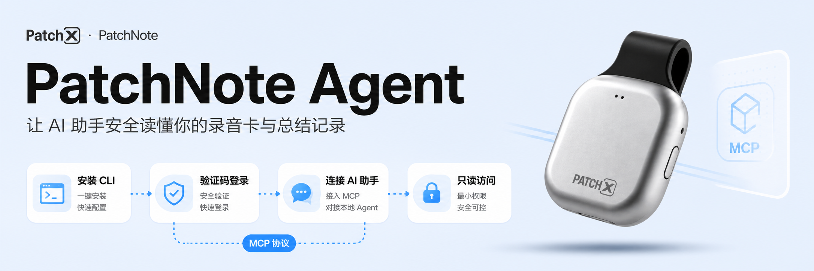
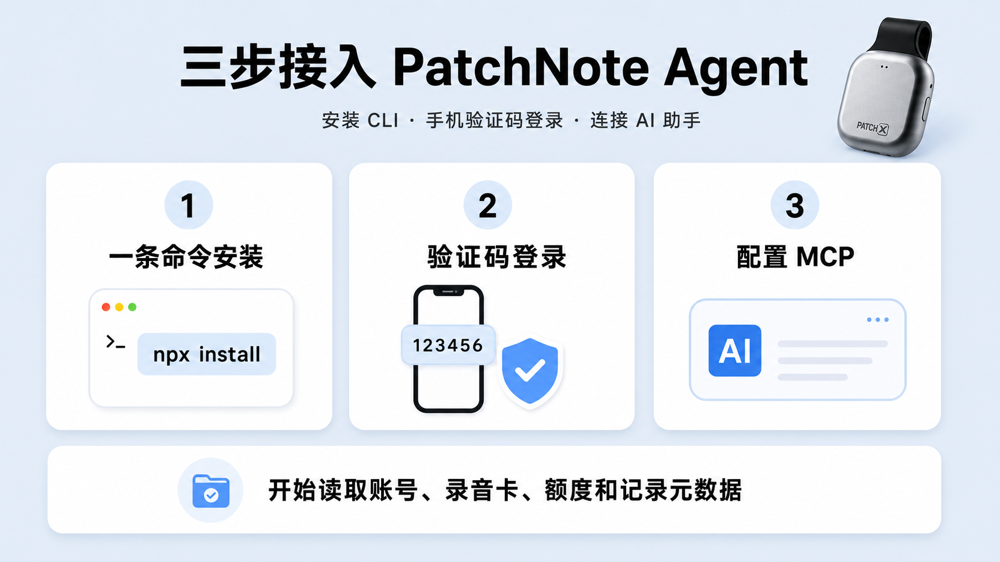
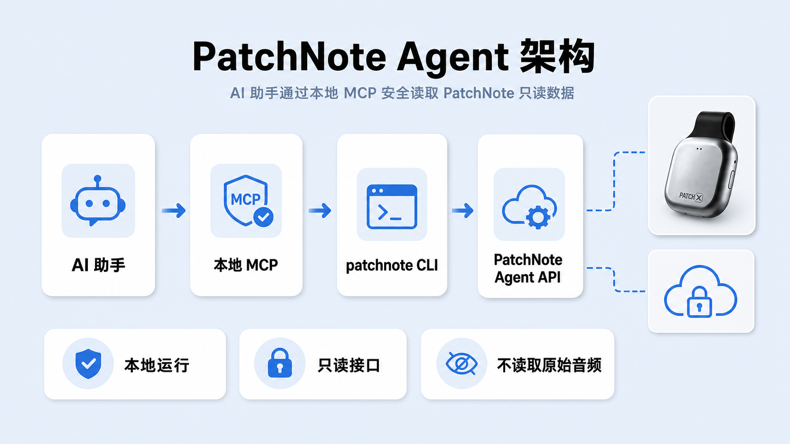
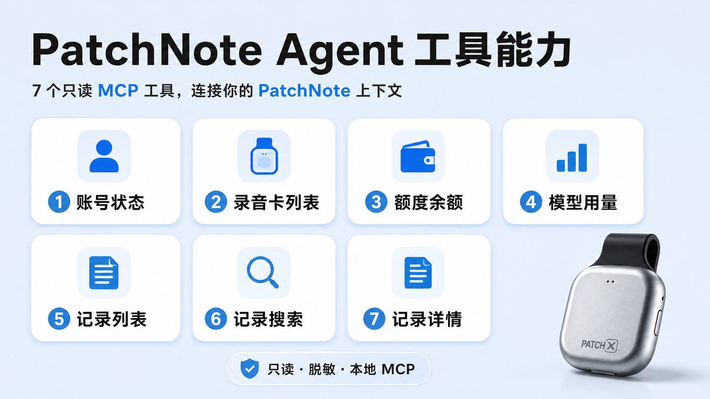
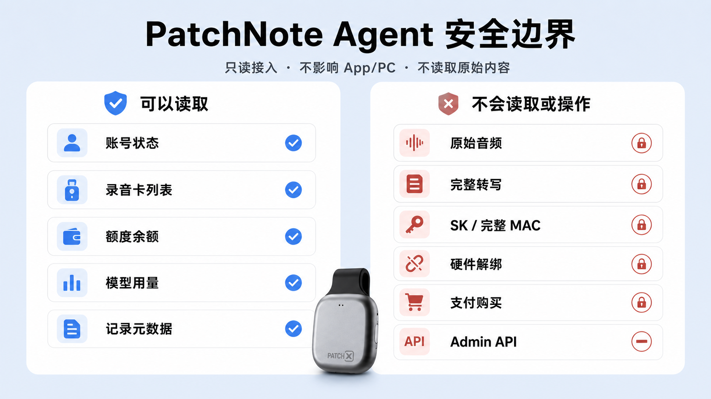

# PatchNote Agent

[English](./README.md) | [简体中文](./README.zh-CN.md)

[](https://www.npmjs.com/package/patchnote-agent)
[](https://github.com/ZsTs119/patchnote-agent/releases)
[](./SECURITY.md)



PatchNote Agent 是 PatchNote 的本地 CLI 和 MCP 桥接工具。它让桌面 AI Agent 可以读取安全的 PatchNote 账号上下文，包括账号状态、已绑定录音卡、额度、模型使用情况和结构化结果元数据。

Agent V1 明确保持只读。它只调用专用的 `/v1/agent/**` PatchNote 服务端 API，不暴露 App/PC 的硬件写入流程、原始音频、完整转写、SK、完整 MAC、供应商 payload、额度购买流程或 Admin API。

```sh
npx -y patchnote-agent@0.1.1 install --print-config
```

## 快速了解

| 维度 | Agent V1 行为 |
| --- | --- |
| 运行方式 | 通过 npm 安装壳下载并安装版本化的原生 `patchnote` 二进制。 |
| Agent 协议 | 通过 `patchnote mcp serve` 启动本地 stdio MCP server。 |
| 登录 | 手机验证码登录，创建独立 Agent 会话，不占用 mobile/desktop 安装位。 |
| 数据访问 | 读取有边界的账号、录音卡、额度、模型使用和结构化结果元数据投影。 |
| 安全边界 | 只读、脱敏、按平台隔离，并且只走专用 Agent 服务端接口。 |
| 包状态 | 公开 beta 版 `0.1.1`，默认连接 PatchNote 测试 API。 |

## 功能

| 能力 | `0.1.1` 是否支持 | 说明 |
| --- | --- | --- |
| 手机验证码 Agent 登录 | 支持 | 使用 Agent 专用登录态，不影响 mobile/desktop 安装位。 |
| 本地 MCP server | 支持 | 通过 `patchnote mcp serve` 使用 stdio 通信。 |
| 当前账号投影 | 支持 | 返回状态、脱敏手机号、注册平台、状态版本。 |
| 录音卡列表 | 支持 | 只读投影，只返回脱敏标识。 |
| 额度汇总 | 支持 | 返回当前账号 token 额度概览。 |
| 模型使用汇总 | 支持 | 返回当月模型使用和扣费额度概览。 |
| 结构化结果元数据 | 支持 | 按 `mobile` 或 `desktop` 平台隔离。 |
| 本地记忆搜索 | 支持 | 搜索当前 MCP 会话中已授权缓存的元数据。 |
| 硬件绑定/解绑/恢复 | 不支持 | 仍由 App/PC 和 MR20 流程负责。 |
| 原始音频/完整转写/下载 | 不支持 | V1 明确不暴露。 |
| 模型执行 | 不支持 | Agent V1 只读。 |

## 环境要求

- Node.js `18` 或更高版本，用于 npm 安装壳。
- Windows、macOS 或 Linux，支持 `amd64` 和 `arm64`。
- 可以接收手机验证码的 PatchNote 账号。
- 支持 stdio MCP server 的 MCP Host，例如 Codex、Claude Desktop、Cursor、VS Code 或其他兼容桌面 Agent。

> `0.1.1` 是 beta 构建。默认服务端是 PatchNote 测试 API，系统原生安全钥匙串适配仍在补齐中。

## 快速开始



安装 npm 包。它会从 GitHub Releases 下载匹配平台的 `patchnote` 二进制，校验 `checksums.txt`，并安装到用户可写目录。

```sh
npx -y patchnote-agent@0.1.1 install --print-config
```

安装器会打印：

- 已安装的二进制路径
- 如果 `patchnote` 还不在 PATH 中，会打印 PATH 配置提示
- 使用绝对二进制路径的 MCP 配置片段

第一个 beta 版本默认连接 PatchNote 测试 API：

```text
https://ws-lab.patch-x.cn/patchnote-test-api
```

登录并检查会话状态。

macOS/Linux：

```sh
PATCHNOTE_AUTH_INSECURE_FILE_KEYCHAIN=true patchnote login
patchnote auth status
```

Windows PowerShell：

```powershell
$env:PATCHNOTE_AUTH_INSECURE_FILE_KEYCHAIN = "true"
patchnote login
patchnote auth status
```

启动 MCP server：

```sh
patchnote mcp serve
```

如果要切换到其他 PatchNote 环境：

```sh
PATCHNOTE_SERVER_BASE_URL=<PatchNote API base URL> \
PATCHNOTE_AUTH_INSECURE_FILE_KEYCHAIN=true \
patchnote login
```

## MCP 配置



使用安装器 `--print-config` 打印的配置。典型配置如下：

```json
{
  "mcpServers": {
    "patchnote": {
      "command": "/absolute/path/to/patchnote",
      "args": ["mcp", "serve"],
      "env": {
        "PATCHNOTE_AUTH_INSECURE_FILE_KEYCHAIN": "true"
      }
    }
  }
}
```

MCP 配置中不会保存 access token 或 refresh token。beta 阶段的 `PATCHNOTE_AUTH_INSECURE_FILE_KEYCHAIN=true` 是显式开关，因为系统原生安全钥匙串适配还没有发布。

## MCP 工具



| 工具 | 用途 |
| --- | --- |
| `patchnote_get_current_user` | 读取当前 PatchNote 账号投影。 |
| `patchnote_list_recorder_cards` | 读取已绑定录音卡列表，只返回脱敏标识。 |
| `patchnote_get_quota_summary` | 读取当前账号额度汇总。 |
| `patchnote_get_model_usage_summary` | 读取当月模型使用汇总。 |
| `patchnote_list_memories` | 按平台列出安全的结构化结果元数据。 |
| `patchnote_search_memories` | 搜索当前会话已授权缓存的记忆元数据。 |
| `patchnote_get_memory` | 读取单条结构化结果的安全元数据。 |

记忆类工具必须显式传入 `platform`：`mobile` 或 `desktop`。V1 的记忆响应只包含安全元数据，不重建模型运行响应正文，也不返回旧的完整摘要文本。

可以在桌面 Agent 中这样询问：

```text
查看我的 PatchNote 账号和额度状态。
列出我的 PatchNote 录音卡。
搜索 desktop 平台里和 roadmap 相关的 PatchNote 记忆。
```

## CLI 命令

```sh
patchnote version
patchnote login
patchnote auth status
patchnote logout
patchnote mcp serve
```

常用全局参数：

```sh
--server-base-url <url>   PatchNote API base URL
--profile <name>          本地 profile 名称
--output json             支持时输出机器可读 JSON
--config <path>           非 secret 配置文件路径
```

npm 包本身只是安装/更新/卸载壳：

```sh
npx -y patchnote-agent@0.1.1 install
npx -y patchnote-agent@0.1.1 update
npx -y patchnote-agent@0.1.1 uninstall
```

## 安全与风险提示



PatchNote Agent 会让 AI Agent 访问当前登录 PatchNote 用户的账号元数据。请把 MCP Host 视为受信软件，并注意 prompt、工具调用和日志中可能出现的账号上下文。

默认安全边界：

- Agent 登录态独立于 App/PC 的 `mobile` 和 `desktop` 安装位。
- Agent 只调用专用只读 `/v1/agent/**` 服务端路由。
- MCP 在本地通过 stdio 运行；stdout 只用于 JSON-RPC。
- MCP 配置不保存 bearer token、refresh token、验证码、SK 或完整 MAC。
- 录音卡标识会被脱敏；不暴露实时 BLE 状态、电量、存储和录音状态。
- 结构化内容按平台隔离。Agent 不会合并 mobile 和 desktop 内容。
- 工具输出在返回给 MCP client 前会做边界控制和校验。

不要把 access token、refresh token、验证码、原始手机号、完整 MAC、SK、原始音频、完整转写、prompt 或供应商 payload 发到公开 Issue。安全问题请使用 [SECURITY.md](./SECURITY.md) 中的私密流程。

## 当前限制

`0.1.1` 是首个 beta 版本。

- 默认服务端指向 PatchNote 测试 API。
- 凭据存储需要显式开启 beta 文件存储：`PATCHNOTE_AUTH_INSECURE_FILE_KEYCHAIN=true`。
- 系统原生 keychain 适配仍未发布。
- macOS 执行冒烟仍待补齐。
- 生产 Agent 路由仍待上线。
- `patchnote_search_memories` 只搜索当前 MCP 会话中已缓存的元数据。
- 原始音频、完整转写、完整模型响应、硬件写操作、额度购买/领取、支付和 Admin API 都不在 V1 范围内。

## 常见问题排查

| 问题 | 检查项 |
| --- | --- |
| 安装后找不到 `patchnote` | 把安装器打印的目录加入 PATH，然后打开新终端。 |
| 登录提示凭据存储不可用 | beta 测试阶段设置 `PATCHNOTE_AUTH_INSECURE_FILE_KEYCHAIN=true`。 |
| MCP Host 启动失败 | 使用 `--print-config` 打印出的绝对 `command` 路径。 |
| 记忆列表为空 | 检查是否选择了正确的 `platform`：`mobile` 或 `desktop`。 |
| checksum 校验失败 | 稍后重试或固定已知版本；安装器会拒绝未校验二进制。 |
| 连到了错误服务端 | 设置 `PATCHNOTE_SERVER_BASE_URL=<PatchNote API base URL>`。 |

## 验证安装

```sh
npm view patchnote-agent@0.1.1 version --registry https://registry.npmjs.org
npx -y --registry https://registry.npmjs.org patchnote-agent@0.1.1 install --dry-run --print-config
patchnote version
```

发布二进制应报告版本 `0.1.1`，commit 为 `8c82973d690b7ca58b79ddbab7d57e5a2a82f470`。

## 开发

本地检查：

```sh
go test ./...
scripts/e2e/mvp-smoke.sh
node packages/npm/bin/patchnote-agent.js install --dry-run --print-config
```

MVP smoke 会构建 CLI，执行安装器 dry-run，登录进程内 Agent V1 测试服务，检查 `auth status`，启动 `patchnote mcp serve`，调用全部七个 V1 MCP 工具，登出，并扫描 evidence 中是否出现 secret-like 内容。

修改 CLI 行为、安装器逻辑、MCP 工具、认证、本地缓存或发布配置前，请先阅读：

- [AGENTS.md](./AGENTS.md)
- [docs/engineering-rules.md](./docs/engineering-rules.md)
- [docs/plans/2026-08-06-agent-v1-mvp.md](./docs/plans/2026-08-06-agent-v1-mvp.md)

## 发布维护说明

1. 确认目标 PatchNote GoServer 已暴露所需 `/v1/agent/**` 路由。
2. 确认 `packages/npm/package.json` 版本与 release tag 一致，tag 不带前缀 `v` 时要匹配包版本。
3. 推送干净 tag，例如 `v0.1.1`。
4. 等待 GitHub Release 产物：`checksums.txt`，以及 Linux/macOS/Windows 的 amd64 和 arm64 二进制。
5. npm publish 前确认 npm Trusted Publishing 已配置：
   - owner/user：`ZsTs119`
   - repository：`patchnote-agent`
   - workflow filename：`publish-npm.yml`
   - allowed action：`npm publish`
6. 只有 release 产物存在且 trusted publisher 配好后，才发布 npm。
7. Trusted publish 成功后，撤销旧 npm automation token，并禁止该包继续使用 token-based publishing。

## 许可证

当前仓库尚未发布开源许可证。重新分发或嵌入其他产品前，请先联系 PatchNote。
