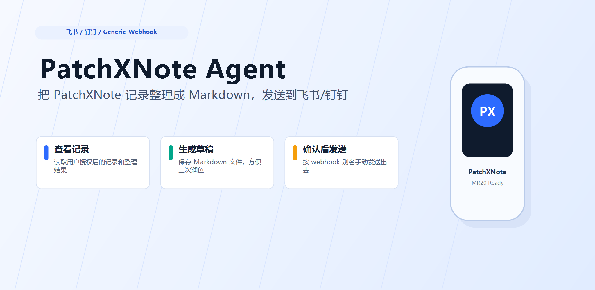

# PatchXNote Agent 发布与维护 Runbook

这份文档用于后续开发新功能、更新文档、发布 GitHub Release 和 npm 包时保持同一套事实源。它沉淀的是当前 `patchxnote-agent` 公测发布链路，不替代具体 feature 设计文档。

## 当前发布事实

- GitHub 仓库：`https://github.com/ZsTs119/patchxnote-agent`
- npm 包：`patchxnote-agent`
- 用户安装命令：`npx -y patchxnote-agent install`
- 本地二进制：`patchxnote`
- MCP Server 命令：`patchxnote mcp serve`
- MCP 工具前缀：`patchxnote_*`
- 环境变量前缀：`PATCHXNOTE_`
- npm 发布方式：Trusted Publishing / GitHub Actions OIDC
- npm 发布 workflow：`.github/workflows/publish-npm.yml`
- GitHub Release workflow：`.github/workflows/release.yml`
- macOS 安装冒烟 workflow：`.github/workflows/macos-install-smoke.yml`
- 当前公测服务端：PatchXNote 公测 API，具体默认值以 `internal/config/config.go` 为准

历史兼容事实：

- 旧 npm 包 `patchnote-agent` 已被新包名替代。
- 旧二进制名 `patchnote` 已被 `patchxnote` 替代。
- `PATCHNOTE_` 环境变量只允许作为兼容 fallback 存在，不应再出现在公开文档的新命令中。

## 文档事实源

开发和发布前优先阅读：

1. `AGENTS.md`
2. `README.md`
3. `README.zh-CN.md`
4. `docs/engineering-rules.md`
5. `docs/release-and-maintenance-runbook.zh-CN.md`
6. `docs/plans/2026-08-06-agent-v1-mvp.md`
7. GoServer Agent 合同：`../patchxNoteGoServer/docs/engineering/agent-access-v1.md`
8. GoServer 集成文档：`../patchxNoteGoServer/docs/integrations/apifox/integration-guide.zh-CN.md`
9. 飞书公开指南源文件：`../patchxNoteGoServer/docs/integrations/patchnote-agent-feishu-guide.zh-CN.md`

服务端 OpenAPI / Agent 合同优先级高于本仓库 README。发现冲突时先记录冲突，再改代码。

## 仓库职责边界

本仓库负责：

- `patchxnote` CLI
- 本地 MCP stdio bridge
- MCP tool schema 和 tool registry
- npm 安装壳
- 本地非 secret 配置
- 系统原生钥匙串集成
- 本地缓存和当前会话 search
- GitHub Release / npm 发布链路

本仓库不负责：

- 账号、额度、录音卡归属、模型用量和结构化结果的事实源
- App/PC 安装槽和替换逻辑
- MR20 BLE、本地录音、原始音频、完整转写、声纹、SK
- 支付、购买额度、每日奖励、Admin

新增能力如果依赖服务端字段，先改 GoServer Agent 只读 projection，再改 CLI/MCP。

## 新功能开发流程

### 1. 先确认产品边界

开发前先回答：

- 这是只读能力还是写能力？
- 是否需要新增 GoServer `/v1/agent/**` endpoint？
- 是否会读取 raw audio、完整 transcript、provider payload、prompt、SK、完整 MAC？
- 是否会影响 App/PC 登录、绑定、解绑、额度、支付、模型执行主流程？
- 是否需要新增 MCP tool，还是扩展现有 tool 的字段？

V1 公测默认只允许只读能力。写能力必须先有服务端设计和授权矩阵。

### 2. 先锁定服务端合同

如果涉及服务端数据：

- 更新或确认 GoServer Agent 设计文档。
- 更新或确认 OpenAPI。
- 更新 `internal/api/types.go`。
- 新增或更新 `testdata/api/*.json`，不得包含真实手机号、token、完整 MAC、SK、原始音频、完整转写或 provider payload。
- 更新 API client 测试。

不要从 App/PC 接口行为反推 Agent 字段。服务端没有存的值不要在 Agent 里猜，例如录音卡实时电量。

### 3. 再实现 CLI/MCP

常见文件位置：

- CLI 命令：`internal/cli/*.go`
- API client：`internal/api/*.go`
- MCP tools：`internal/mcp/tools.go`
- 本地缓存/search：`internal/cache/*.go`
- keychain：`internal/keychain/*.go`
- npm 安装壳：`packages/npm/bin/patchxnote-agent.js`

新增 MCP tool 必须包含：

- tool name：`patchxnote_*`
- 只读/写入说明
- required scope
- input schema
- limit / pagination
- 稳定错误映射
- 输出大小上限
- secret / 敏感字段测试

## 本地验证门禁

普通代码或文档发布前至少跑：

```sh
go test ./...
scripts/e2e/mvp-smoke.sh
```

npm 安装壳变更时还要跑：

```sh
node packages/npm/test/install.test.js
```

WSL 环境目前可能没有 Linux Node；Windows npm 直接在 WSL UNC 路径下执行 `npm pack` 可能会把路径拼成重复的 `Ubuntu-22.04`。遇到这个问题时，把 `packages/npm` 复制到 Windows 临时目录再跑：

```powershell
$src = "\\wsl.localhost\Ubuntu-22.04\home\zsts_119\patchnote-agent\packages\npm"
$tmp = Join-Path $env:TEMP ("patchxnote-npm-pack-" + [guid]::NewGuid().ToString())
New-Item -ItemType Directory -Path $tmp | Out-Null
Copy-Item -Recurse -Path (Join-Path $src "*") -Destination $tmp
Push-Location $tmp
npm pack --dry-run
Pop-Location
```

文档-only 变更至少跑：

```sh
git diff --check
```

如果文档包含图片链接，再跑图片路径校验。

```sh
python3 - <<'PY'
from pathlib import Path
import re
for md in [Path("README.md"), Path("README.zh-CN.md")]:
    if not md.exists():
        continue
    text = md.read_text(encoding="utf-8")
    missing = []
    for _, url in re.findall(r'!\[([^\]]*)\]\(([^)]+)\)', text):
        if "://" in url or url.startswith("#"):
            continue
        if not (md.parent / url).exists():
            missing.append(url)
    if missing:
        raise SystemExit(f"{md}: missing images {missing}")
print("image links ok")
PY
```

## 发包流程

### 1. 发布前检查

确认：

- `git status --short` 干净，或者只包含本次发布变更。
- `packages/npm/package.json` 的 `version` 是目标版本。
- README / 中文 README / npm README 中的 pin 版本同步。
- `.github/workflows/publish-npm.yml` 没有 `NODE_AUTH_TOKEN` 或 `NPM_TOKEN`。
- `gh secret list --repo ZsTs119/patchxnote-agent` 不应包含 npm 发布 token。
- npm 包 `patchxnote-agent` 的 Trusted Publisher 指向：
  - publisher：GitHub Actions
  - owner：`ZsTs119`
  - repository：`patchxnote-agent`
  - workflow：`publish-npm.yml`
  - allowed action：`npm publish`
- npm package setting 建议为 disallow bypass 2FA tokens。

### 2. 提交主分支

```sh
git add <changed files>
git commit -m "<release or feature message>"
git push origin main
```

### 3. 打 tag 触发 GitHub Release

```sh
git tag vX.Y.Z
git push origin vX.Y.Z
```

等待 Release workflow：

```sh
gh run list --repo ZsTs119/patchxnote-agent --workflow release.yml --limit 5
gh run view <run-id> --repo ZsTs119/patchxnote-agent --json status,conclusion,url
```

必须看到 GitHub Release 中存在：

```text
checksums.txt
patchxnote_X.Y.Z_darwin_amd64
patchxnote_X.Y.Z_darwin_arm64
patchxnote_X.Y.Z_linux_amd64
patchxnote_X.Y.Z_linux_arm64
patchxnote_X.Y.Z_windows_amd64.exe
patchxnote_X.Y.Z_windows_arm64.exe
```

### 4. 发布 npm

Release 资产存在后触发 npm publish：

```sh
gh workflow run publish-npm.yml --repo ZsTs119/patchxnote-agent -f version=X.Y.Z
```

等待 publish workflow：

```sh
gh run list --repo ZsTs119/patchxnote-agent --workflow publish-npm.yml --limit 5
gh run view <run-id> --repo ZsTs119/patchxnote-agent --json status,conclusion,url
```

成功日志应出现 npm provenance：

```text
Signed provenance statement with source and build information from GitHub Actions
```

如果发布同版本，预期失败是：

```text
You cannot publish over the previously published versions: X.Y.Z.
```

这个错误说明认证已经通过，只是 npm 正常拒绝覆盖不可变版本。

### 5. 发布后验证

检查 npm latest：

```sh
npm view patchxnote-agent version dist-tags.latest repository.url --registry https://registry.npmjs.org
```

Windows 安装验证：

```powershell
$tmp = Join-Path $env:TEMP ("patchxnote-agent-real-" + [guid]::NewGuid().ToString())
New-Item -ItemType Directory -Path $tmp | Out-Null
Push-Location $tmp
npx -y --registry https://registry.npmjs.org patchxnote-agent install --install-dir $tmp
& (Join-Path $tmp "patchxnote.exe") version --output json
Pop-Location
```

Linux Release 资产验证：

```sh
tmp=$(mktemp -d)
cd "$tmp"
base="https://github.com/ZsTs119/patchxnote-agent/releases/download/vX.Y.Z"
curl -fsSLO "${base}/checksums.txt"
curl -fsSLO "${base}/patchxnote_X.Y.Z_linux_amd64"
grep "patchxnote_X.Y.Z_linux_amd64" checksums.txt | sha256sum -c -
chmod +x patchxnote_X.Y.Z_linux_amd64
./patchxnote_X.Y.Z_linux_amd64 version --output json
```

macOS 安装和 MCP 验证：

```sh
gh workflow run macos-install-smoke.yml --repo ZsTs119/patchxnote-agent -f version=X.Y.Z
gh run list --repo ZsTs119/patchxnote-agent --workflow macos-install-smoke.yml --limit 5
```

### 6. 发布后记录

更新 `docs/plans/2026-08-06-agent-v1-mvp.md` 的 Phase 12 发布状态，记录：

- Release workflow run id
- npm publish workflow run id
- Windows install smoke 结果
- Linux release-asset smoke 结果
- macOS install/MCP smoke run id
- npm provenance / OIDC 状态
- 剩余风险或人工操作

## 文档同步流程

每次公开能力、版本、安装命令、MCP tool、默认服务端或安全边界变化后，同步：

1. `README.md`
2. `README.zh-CN.md`
3. `packages/npm/README.md`
4. `SECURITY.md`，仅当安全范围或上报范围变化
5. `docs/engineering-rules.md`，仅当长期工程规则变化
6. `docs/plans/2026-08-06-agent-v1-mvp.md`，记录阶段事实和验收
7. GoServer 飞书指南：`../patchxNoteGoServer/docs/integrations/patchnote-agent-feishu-guide.zh-CN.md`
8. GoServer 飞书内部备注：`../patchxNoteGoServer/docs/integrations/patchnote-agent-feishu-guide-internal-notes.zh-CN.md`

GoServer 飞书指南文件名当前仍是 `patchnote-agent-feishu-guide.zh-CN.md`，这是历史文件名。不要只因为品牌改为 PatchXNote 就随意重命名，除非同步所有引用。

飞书导入再导出 Markdown 时，图片经常会变成：

```text
图片和附件/xxx.png
```

提交前必须改回仓库内路径，例如：

```md

```

GoServer 飞书指南图片素材位于：

```text
../patchxNoteGoServer/docs/integrations/assets/
```

Agent 仓库 README 图片素材位于：

```text
docs/assets/
```

## 安全检查清单

提交前确认没有新增：

- 真实手机号
- OTP / 验证码
- access token / refresh token / bearer token
- full MAC
- SK / credential
- provider key
- 原始音频
- 完整转写
- prompt / provider payload
- npm token

常用检查：

```sh
grep -RInE "access_token|refresh_token|Bearer |otp|sk_|protocol_mac|NPM_TOKEN|NODE_AUTH_TOKEN" . \
  --exclude-dir=.git \
  --exclude-dir=.tmp \
  --exclude-dir=dist
```

命中并不一定都是问题，例如测试里的错误码字段可以存在；但任何真实 secret 或用户数据都不能提交。

## 常见坑

- npm 版本不可覆盖。发布错了只能发新 patch 版本，不能重发同一个版本。
- Trusted Publisher 是按 npm package 配置的。换包名后必须重新配置。
- 新 npm 包名第一次发布时，如果包还不存在，可能需要 token bootstrap；包存在后必须切回 Trusted Publishing。
- GitHub workflow 中不要保留 `NODE_AUTH_TOKEN`，否则会绕过 OIDC。
- npm 网站删除 token 后，可以用“重复发布已存在版本”的方式验证 OIDC 仍通：期望失败原因是 immutable version，不是 auth error。
- Windows npm 在 WSL UNC 路径下可能解析路径错误。打包测试用 Windows 临时目录。
- GoServer 没有存的字段，Agent 不能展示成工具能力。
- MCP stdio 的 stdout 只能输出 JSON-RPC，日志和诊断必须走 stderr。
- 用户宣传命令推荐不 pin 版本：`npx -y patchxnote-agent install`。排障和回滚文档可以 pin 具体版本。

## 回滚策略

npm 已发布版本不可修改。出现问题时：

1. 立即停止宣传新版本。
2. 用 README / 飞书文档临时建议用户 pin 上一个稳定版本：

```sh
npx -y patchxnote-agent@X.Y.Z install
```

3. 如问题严重，执行 npm deprecate：

```sh
npm deprecate patchxnote-agent@BAD_VERSION "Please upgrade to X.Y.Z or newer."
```

4. 修复后发新的 patch 版本。
5. 更新 Phase 12 记录和飞书指南。

## 新功能发布前最终 Checklist

- [ ] 服务端 Agent 合同已确认或已更新
- [ ] 本仓库 API fixtures 已同步
- [ ] CLI/MCP 实现和测试已同步
- [ ] `go test ./...` PASS
- [ ] `scripts/e2e/mvp-smoke.sh` PASS
- [ ] npm wrapper 测试 PASS，如本次涉及 installer
- [ ] README / 中文 README / npm README 已同步
- [ ] GoServer 飞书指南已同步
- [ ] 图片链接已校验
- [ ] 没有 secret / 用户数据 / 原始内容进入仓库
- [ ] GitHub Release workflow PASS
- [ ] npm Trusted Publishing PASS
- [ ] Windows install smoke PASS
- [ ] Linux release asset smoke PASS
- [ ] macOS install/MCP smoke PASS
- [ ] Phase 12 发布记录已补齐
